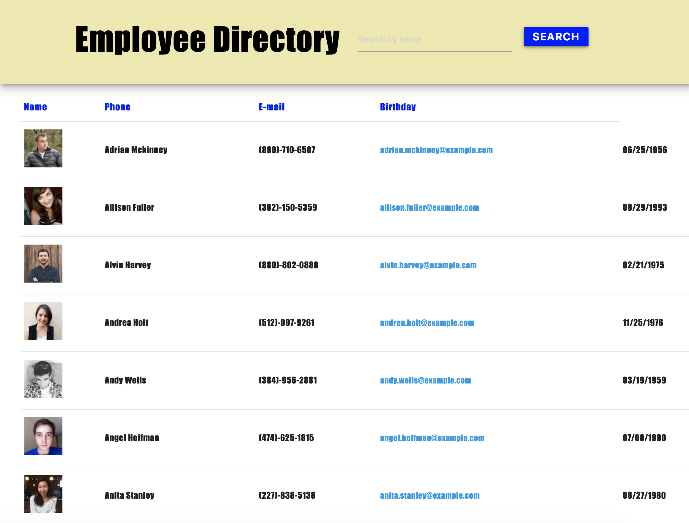

[contributors-shield]: https://img.shields.io/github/contributors/hilaryvalenciawalsh/employee-directory.svg?style=flat-square
[contributors-url]: https://github.com/hilaryvalenciawalsh/employee-directory/graphs/contributors
[forks-shield]: https://img.shields.io/github/forks/hilaryvalenciawalsh/employee-directory.svg?style=flat-square
[forks-url]: https://github.com/hilaryvalenciawalsh/employee-directory/network/members
[stars-shield]: https://img.shields.io/github/stars/hilaryvalenciawalsh/employee-directory.svg?style=flat-square
[stars-url]: https://github.com/hilaryvalenciawalsh/employee-directory/stargazers
[issues-shield]: https://img.shields.io/github/issues/hilaryvalenciawalsh/employee-directory.svg?style=flat-square
[issues-url]: https://github.com/hilaryvalenciawalsh/employee-directory/issues
[![Contributors][contributors-shield]][contributors-url] [![Forks][forks-shield]][forks-url] [![Stargazers][stars-shield]][stars-url] [![Issues][issues-shield]][issues-url] 
# employee-directory

## Description
For this assignment, you'll create a employee directory with React. This assignment will require you to break up your application's UI into components, manage component state, and respond to user events.
As a user, I want to be able to view my entire employee directory at once so that I have quick access to their information.

## Deployed Link

## Table of Contents
- [Title](#title)
- [Description](#description)
- [Table of Contents](#table-of-contents)
- [Screenshots](#screenshots)
- [License](#license)
- [Questions](#questions)

## Screenshots

## License
This project is licensed under the ISC License
   
## Questions
Please contact me using one of the following:
    
- Github: [hilaryvalenciawalsh](https://gist.github.com/hilaryvalenciawalsh)   
    
- Email: hilaryvalenciawalsh@gmail.com;
    
